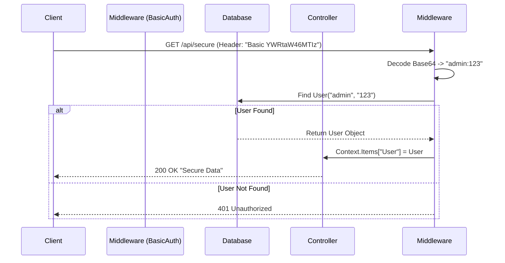

# Auth Level 1: Basic Authentication

This project demonstrates the simplest way to authenticate: sending credentials with every request.

## Middleware Flow Diagram


## What Each File Does

### 1. `Program.cs`
*   **Role:** The entry point.
*   **Key Line:** `app.UseMiddleware<BasicAuthMiddleware>();` registers our custom logic into the request pipeline.
*   **Database:** Calls `db.Database.EnsureCreated()` to auto-generate `auth.db`.

### 2. `Middleware/BasicAuthMiddleware.cs`
*   **Role:** The Security Guard.
*   **Logic:**
    1.  Checks if the `Authorization` header exists.
    2.  Decodes the Base64 string.
    3.  Queries SQLite to see if the user exists.
    4.  If valid, it lets the request pass (`_next(context)`).

### 3. `Controllers/SecureDataController.cs`
*   **Role:** The VIP Room.
*   **Logic:** It assumes that if the request reached it, the user is already authenticated (thanks to the middleware).

---

## Step-by-Step: How to Run
1.  **Open Terminal** in this folder.
2.  **Run Command:** `dotnet run`
3.  **Copy URL:** Look for `Now listening on: https://localhost:xxxx`.
4.  **Open Swagger:** Go to `https://localhost:xxxx/swagger`.
5.  **Authorize:**
    *   Click the **Authorize** button.
    *   Username: `admin`
    *   Password: `123`
    *   Click **Login**, then **Close**.
6.  **Test:** Expand `GET /api/SecureData`, click **Try it out**, then **Execute**.
    *   *Result:* You should see a 200 OK response.

## How to Run in Postman
1.  **Method:** `GET`
2.  **URL:** `https://localhost:7000/api/SecureData` (Check console for port)
3.  **Authorization Tab:**
    *   **Type:** Basic Auth
    *   **Username:** `admin`
    *   **Password:** `123`
4.  **Send:** Result should be `200 OK`.

## How to Run in JavaScript (Fetch)

### Discussion
For Basic Auth, we create a Base64 string of `username:password` and attach it to the `Authorization` header. We use `btoa()` in the browser to encode.

### Code
```javascript
const username = "admin";
const password = "123";
const credentials = btoa(`${username}:${password}`); // Encode to Base64

fetch("https://localhost:7000/api/SecureData", {
    method: "GET",
    headers: {
        "Authorization": `Basic ${credentials}` // "Basic YWRtaW46MTIz"
    }
})
.then(response => {
    if (response.status === 200) return response.text();
    throw new Error("Unauthorized!");
})
.then(data => console.log("Success:", data))
.catch(error => console.error("Error:", error));
```
