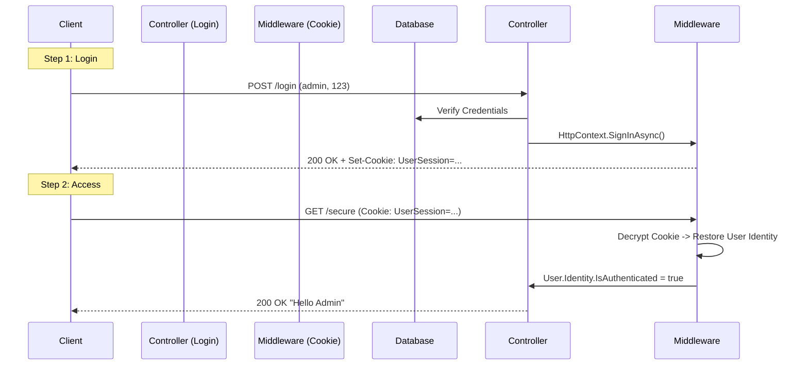

# Auth Level 2: Cookie Authentication

This project uses ASP.NET Core's built-in **Cookie Authentication**. This is stateful—the server remembers the "Session".

## Authentication Flow Diagram


## What Each File Does

### 1. `Program.cs`
*   **Role:** Configuration.
*   **Key Line:** `builder.Services.AddAuthentication().AddCookie(...)` sets up the encryption settings for the cookie.
*   **Key Line:** `app.UseAuthentication()` enables the middleware that reads the cookie.

### 2. `Controllers/AuthController.cs`
*   **Role:** Issuing the Ticket.
*   **Login Method:** Checks the DB, creates a `ClaimsPrincipal`, and calls `SignInAsync`. This tells ASP.NET to serialize the user info into an encrypted cookie.
*   **Secure Method:** Checks `User.Identity.IsAuthenticated` to ensure only valid ticket-holders enter.

---

## Step-by-Step: How to Run
1.  **Open Terminal** in this folder.
2.  **Run Command:** `dotnet run`
3.  **Open Swagger:** Go to `https://localhost:xxxx/swagger`.
4.  **Step A (Login):**
    *   Go to `/api/Auth/login`.
    *   Enter `admin` and `123`.
    *   Execute. **Result:** 200 OK.
    *   *Note:* The Browser (and Swagger) automatically saves the Cookie received.
5.  **Step B (Access):**
    *   Go to `/api/Auth/secure`.
    *   Execute. **Result:** 200 OK.

## How to Run in Postman
*Note: Postman naturally handles Cookies like a browser.*
1.  **Login Request:**
    *   **Method:** `POST`
    *   **URL:** `https://localhost:7000/api/Auth/login?username=admin&password=123`
    *   **Send.** (Status 200 OK. Check "Cookies" tab in response).
2.  **Secure Request:**
    *   **Method:** `GET`
    *   **URL:** `https://localhost:7000/api/Auth/secure`
    *   **Send.** (Status 200 OK. The Cookie from step 1 is automatically sent).

## How to Run in JavaScript (Fetch)

### Discussion
For Cookies, we must tell `fetch` to **include credentials**. This ensures the browser sends the `Set-Cookie` received from Login along with subsequent requests.

### Code
```javascript
// Step 1: Login (Browser saves the cookie automatically)
fetch("https://localhost:7000/api/Auth/login?username=admin&password=123", {
    method: "POST",
    headers: { "Content-Type": "application/json" },
    credentials: "include" // CRITICAL: Tells browser to handle cookies
})
.then(response => {
    if (response.ok) {
        console.log("Login Success! Cookie saved.");
        
        // Step 2: Access Secure Data (Cookie sent automatically)
        return fetch("https://localhost:7000/api/Auth/secure", {
            method: "GET",
            credentials: "include" // CRITICAL: Sends the saved cookie
        });
    }
    throw new Error("Login Failed");
})
.then(res => res.text())
.then(data => console.log("Secure Data:", data))
.catch(err => console.error(err));
```

