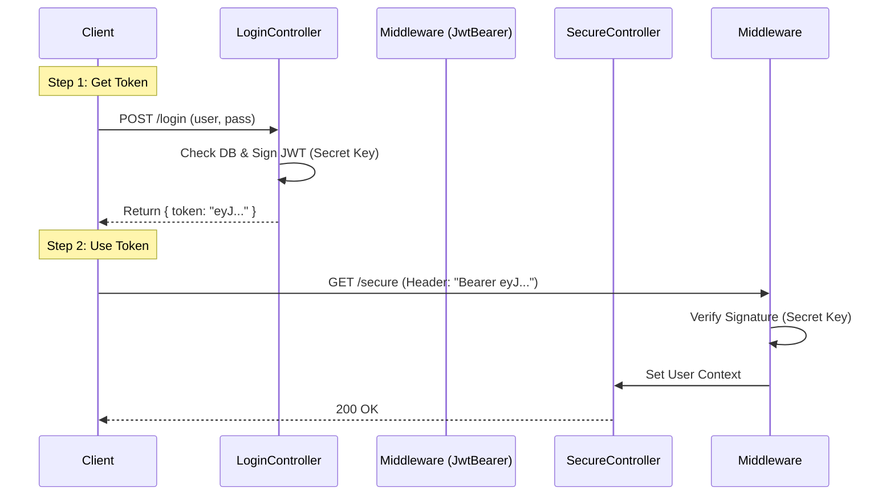

# Auth Level 3: JWT (Stateless)

This project demonstrates **JSON Web Tokens**. The server issues a signed token, and the client manages it.

## JWT Flow Diagram


## What Each File Does

### 1. `Program.cs`
*   **Role:** Setup.
*   **Key Line:** `.AddJwtBearer(...)` configures the validation logic. It essentially tells the server: *"Trust any token signed with THIS secret key."*

### 2. `Controllers/AuthController.cs`
*   **Role:** Token Generataion.
*   **Login:** Uses `JwtSecurityTokenHandler` to create the string. It embeds "Claims" (ID, Name, Role) into the payload.

### 3. `Models/User.cs`
*   **Role:** The Blueprint.
*   The `Role` property here ("Admin"/"User") becomes a Claim inside the JWT.

---

## Step-by-Step: How to Run
1.  **Run Command:** `dotnet run`
2.  **Open Swagger:** `https://localhost:xxxx/swagger`.
3.  **Step A (Get Token):**
    *   Expand `POST /api/Auth/login`.
    *   Body: `{ "username": "admin", "password": "123" }`.
    *   Execute.
    *   **COPY** the long `token` string from the response body.
4.  **Step B (Authorize):**
    *   Click the **Authorize** button at top right.
    *   Type: `Bearer ` (Note the space!) followed by your token.
    *   Example: `Bearer eyJhbGci...`
    *   Click **Authorize**, then Close.
5.  **Step C (Test):**
    *   Expand `GET /api/Auth/secure`.
    *   Execute. **Result:** 200 OK.

## How to Run in Postman
1.  **Login:**
    *   **Method:** `POST`
    *   **URL:** `https://localhost:7000/api/Auth/login`
    *   **Body (Raw JSON):** `{ "username": "admin", "password": "123" }`
    *   **Send.** Copy the `token` from the JSON response.
2.  **Access Secure Endpoint:**
    *   **Method:** `GET`
    *   **URL:** `https://localhost:7000/api/Auth/secure`
    *   **Authorization Tab:**
        *   **Type:** Bearer Token
        *   **Token:** Paste the token here.
    *   **Send.** Result: `200 OK`.

## How to Run in JavaScript (Fetch)

### Discussion
For JWT, we must **manually store** the token (e.g., in `localStorage`) after login. Then, for every request, we manually attach it to the `Authorization: Bearer <token>` header.

### Code
```javascript
// Step 1: Login
fetch("https://localhost:7000/api/Auth/login", {
    method: "POST",
    headers: { "Content-Type": "application/json" },
    body: JSON.stringify({ username: "admin", password: "123" })
})
.then(res => res.json())
.then(data => {
    const token = data.token;
    console.log("Token Received:", token);
    
    // Store it (Optional but recommended)
    localStorage.setItem("authToken", token);

    // Step 2: Use Token
    return fetch("https://localhost:7000/api/Auth/secure", {
        method: "GET",
        headers: {
            "Authorization": `Bearer ${token}` // Attach token here
        }
    });
})
.then(res => res.text())
.then(data => console.log("Secure Data:", data))
.catch(err => console.error(err));
```
