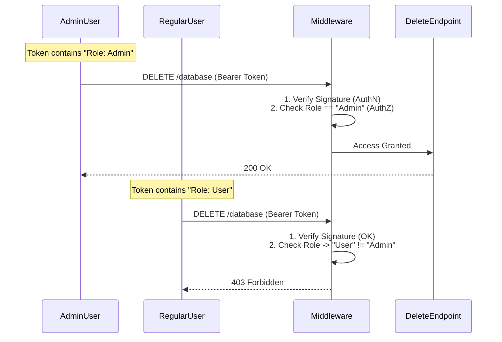

# Auth Level 4: Role-Based Access Control (RBAC)

This project extends JWT by adding **Authorization Rules**. It checks *what* the user is allowed to do.

## RBAC Flow Diagram


## What Each File Does

### 1. `Controllers/AuthController.cs`
*   **Role:** Enforcement.
*   **Attribute:** `[Authorize(Roles = "Admin")]`. This is the Gatekeeper. It looks inside the User's Claims for a claim of type `Role` with value `Admin`.
*   **Attribute:** `[Authorize]`. Allows *any* verified user.

### 2. `Data/AppDbContext.cs`
*   **Role:** Seeding.
*   Creates two users:
    *   `admin` (Role: Admin) -> Can delete database.
    *   `bob` (Role: User) -> Can only view profile.

---

## Step-by-Step: How to Run
1.  **Run Command:** `dotnet run`
2.  **Open Swagger.**
3.  **Test 1 (Failure Scenario):**
    *   Login as `bob` / `123`. Copy Token.
    *   Authorize in Swagger (`Bearer <token>`).
    *   Try `DELETE /api/Auth/delete-database`.
    *   **Result:** `403 Forbidden`. (Authentication worked, Authorization failed).
4.  **Test 2 (Success Scenario):**
    *   Logout (Refresh page) or Clear Auth.
    *   Login as `admin` / `123`. Copy Token.
    *   Authorize in Swagger.
    *   Try `DELETE /api/Auth/delete-database`.
    *   **Result:** `200 OK`.

## How to Run in Postman
1.  **Login (as Admin):**
    *   `POST /api/Auth/login` -> Body: `{ "username": "admin", "password": "123" }`
    *   Copy Token.
2.  **Test Admin Route:**
    *   `DELETE /api/Auth/delete-database`
    *   **Auth Tab:** Bearer Token -> Paste Admin Token.
    *   **Send.** Result: `200 OK`.
3.  **Test User Route (Failure):**
    *   Login as `{ "username": "bob", "password": "123" }`. Copy Token.
    *   Use this new token in Auth Tab.
    *   **Send.** Result: `403 Forbidden`.

## How to Run in JavaScript (Fetch)

### Discussion
This works exactly like Level 3 (JWT). The difference is that if the JWT belongs to a user without the correct `Role`, the server returns `403`. Your JS must handle this status.

### Code
```javascript
const token = localStorage.getItem("authToken"); // Assuming logged in as Admin

fetch("https://localhost:7000/api/Auth/delete-database", {
    method: "DELETE", // Note the specific Verb
    headers: {
        "Authorization": `Bearer ${token}`
    }
})
.then(async response => {
    if (response.status === 200) {
        console.log("Success: Database Deleted!");
    } else if (response.status === 403) {
        console.error("Error: You are logged in, but not an Admin!");
    } else {
        console.error("Error:", response.statusText);
    }
});
```
