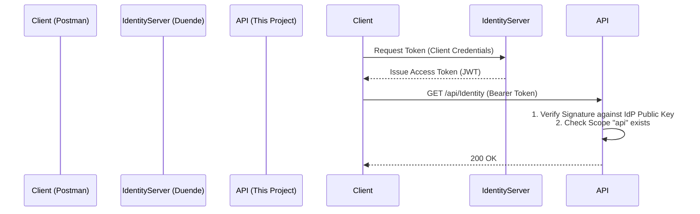

# Auth Level 5: IdentityServer (OAuth 2.0)

This project is an **ApiResource**. It doesn't handle logins. It offloads that to a dedicated server (IdentityProvider).

## OAuth Flow Diagram


## What Each File Does

### 1. `Program.cs`
*   **Role:** Trust Configuration.
*   **Key Line:** `options.Authority = "https://demo.duendesoftware.com"`. This tells the API where to download the public keys to verify signatures.
*   **Policy:** Checks for the claim `scope: api`.

### 2. `Controllers/IdentityController.cs`
*   **Role:** Protected Resource.
*   It assumes `[Authorize(Policy = "ApiScope")]` has passed before executing.

---

## Step-by-Step: How to Run
1.  **Run Command:** `dotnet run`
2.  **Open Swagger.**
3.  **Authorize (The OAuth Way):**
    *   Swagger in this demo is configured for **Bearer** manual entry.
    *   *Real World:* You would use Postman's "Get New Access Token" button pointing to the IdP.
4.  **Testing (Quick Way):**
    *   Since we don't have the external server running locally, this demo is configured to trust the Public Duende Demo server.
    *   This sample code is primarily for **reviewing the configuration**, as running a full OAuth flow requires setting up the IdentityServer project separately (which is outside the scope of this single-project folder).

## How to Run in Postman (OAuth 2.0 Flow)
1.  **Method:** `GET`
2.  **URL:** `https://localhost:7000/api/Identity`
3.  **Authorization Tab:**
    *   **Type:** OAuth 2.0
    *   **Grant Type:** Client Credentials
    *   **Access Token URL:** `https://demo.duendesoftware.com/connect/token`
    *   **Client ID:** `m2m`
    *   **Client Secret:** `secret`
    *   **Scope:** `api`
4.  **Click:** "Get New Access Token".
5.  **Click:** "Use Token".
6.  **Send.** Result: `200 OK`.

## How to Run in JavaScript (Fetch)

### Discussion
In this scenario, your Frontend (SPA) would typically use a library like `oidc-client-js` to handle the complex redirect flow with IdentityServer. However, once you have the `access_token`, the usage is identical to standard JWT.

### Code
```javascript
// Assume 'accessToken' was obtained via OIDC flow
const accessToken = "eyJhbGci..."; 

fetch("https://localhost:7000/api/Identity", {
    method: "GET",
    headers: {
        "Authorization": `Bearer ${accessToken}`
    }
})
.then(res => res.json())
.then(data => console.log("Protected Data:", data));
```
